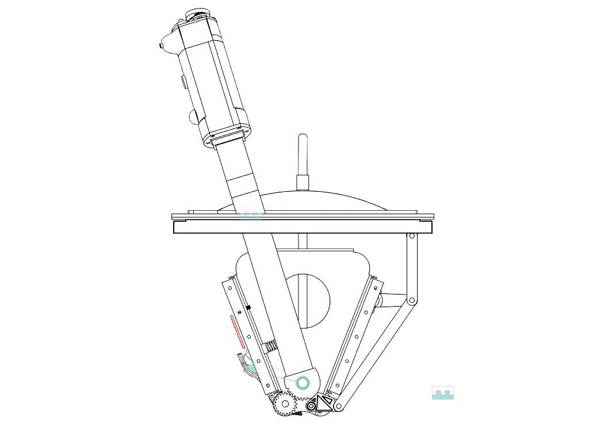

<strong>Document Information</strong>

| Document Title | HoverStop Basic Throttle Quadrant Build Guide |
| :---- | ----- |
| **Document Number** | 0003 |
| **Version Number** | 1.0 |
| **Effective Date** | 03/05/25 |
| **Prepared By** | HoverStop Documentation Team |
| **Reviewed By** |  |
| **Approved By** |  |
| **Next Review Date** | 03/11/25 |
| **Location** | GitHub - hover-stop/docs |

| Version | Date | Description of Change | Changed By |
| ----- | ----- | ----- | ----- |
| 1.0 | 03/05/25 | Initial release | HoverStop Docs Team |
|  |  |  |  |

# HSI Mk1 Grip

This guide will walk you through building...

## Overview

*Figure 1: HSI Mk1 Grip Assembly - Detailed view of the completed grip module with all buttons and switches installed.*

## Video Tutorial

Watch our detailed assembly video tutorial:

<iframe width="560" height="315" src="https://www.youtube.com/embed/dQw4w9WgXcQ" title="HSI Mk1 Grip Assembly Tutorial" frameborder="0" allow="accelerometer; autoplay; clipboard-write; encrypted-media; gyroscope; picture-in-picture" allowfullscreen></iframe>
