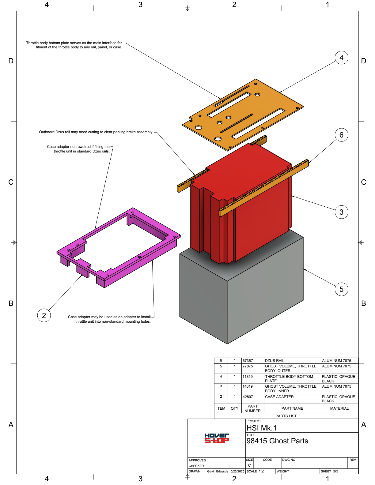

<strong>Document Information</strong>

| Document Title | Understanding Ghost Parts |
| :---- | ----- |
| **Document Number** | 0006 |
| **Version Number** | 1.0 |
| **Effective Date** | 23 May 25 |
| **Prepared By** | Engines |
| **Reviewed By** |  |
| **Approved By** |  |
| **Next Review Date** | 23 Jun 25 |
| **Location** | GitHub - hover-stop/docs |

| Version | Date | Description of Change | Changed By |
| ----- | ----- | ----- | ----- |
| 1.0 | 23 May 25 | Initial release | Engines |

# Understanding Ghost Parts

Ghost parts are virtual or placeholder components used in the design and assembly process to represent physical constraints, volumes, or conceptual elements that do not correspond to actual manufactured parts. They are commonly used in CAD models and assembly documentation to ensure proper fit, alignment, and functionality of the overall design.

## Purpose of Ghost Parts

1. **Define Spatial Constraints**  
   Ghost parts are used to represent the physical boundaries or volumes that other components must fit within or avoid. For example:
   - `14619 - Ghost Volume, Throttle Body, Inner` defines the inner limits of the throttle body design.
   - `77875 - Ghost Volume, Throttle Body, Outer` represents the outer boundaries of the throttle body.

2. **Facilitate Design Alignment**  
   By including ghost parts in CAD models, designers can ensure that all components align correctly and do not interfere with each other.

3. **Document Conceptual Elements**  
   Ghost parts can represent conceptual elements, such as airflow paths, wiring clearances, or mounting zones, that are critical to the design but not physically manufactured.

## Characteristics of Ghost Parts

- **Non-Physical**: Ghost parts are not manufactured or assembled; they exist only in documentation and CAD models.
- **Cost-Free**: Since they are not real parts, their cost is typically listed as `$0.00`.
- **Metadata**: Ghost parts are documented in the BOM and metadata files for reference but are marked with a `Ghost` part type.
- **Parent Assembly**: Ghost parts are often grouped under a "collector" assembly, such as `98415 - Ghost Parts`, to keep them organized.

## Examples in the HSI Mk.1 Project

- **Inner Ghost Volume (`14619`)**: Represents the internal space constraints for the throttle body design.
- **Outer Ghost Volume (`77875`)**: Defines the maximum external dimensions of the throttle body.

### Ghost Parts Used In Drawings

## Best Practices for Using Ghost Parts

1. **Clearly Document Purpose**  
   Include a detailed description in the metadata and requirements documents to explain the role of each ghost part.

2. **Use in CAD Models**  
   Incorporate ghost parts into CAD assemblies to visualize spatial constraints and ensure proper alignment.

3. **Exclude from Manufacturing**  
   Ensure ghost parts are excluded from manufacturing and procurement processes by marking them as `Ghost` in the BOM.

By using ghost parts effectively, designers can streamline the development process and ensure that all components fit and function as intended within the defined design constraints.
